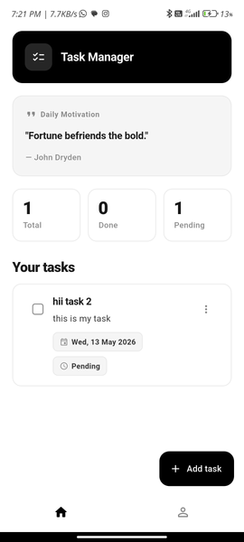

# task_manager

Task Manager is a Flutter app backed by Firebase Authentication and Cloud Firestore.

## Setup

1. Install the Flutter SDK and make sure `flutter doctor` passes for your target platform.
2. Fetch dependencies.

	```bash
	flutter pub get
	```

3. Confirm the Firebase config files are present and match your Firebase project.
	- `google-services.json`
	- `lib/firebase_options.dart`

4. Make sure the Firebase project has Authentication enabled and a Cloud Firestore database created.
5. If you are using a different Firebase project, regenerate the FlutterFire configuration for that project and replace the generated files.
6. Run the app.

	```bash
	flutter run
	```



## Features

- Firebase Authentication sign-in flow.
- Create, edit, and delete tasks.
- Mark tasks as completed or pending.
- Swipe tasks to change status quickly.
- Track total, done, and pending task counts.
- Show a motivational quote on the home screen.

## Notes

- The app stores tasks under `users/{userId}/tasks/{taskId}` in Firestore.
- Firestore security rules must allow the signed-in user to access only their own documents.
